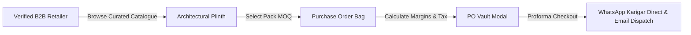
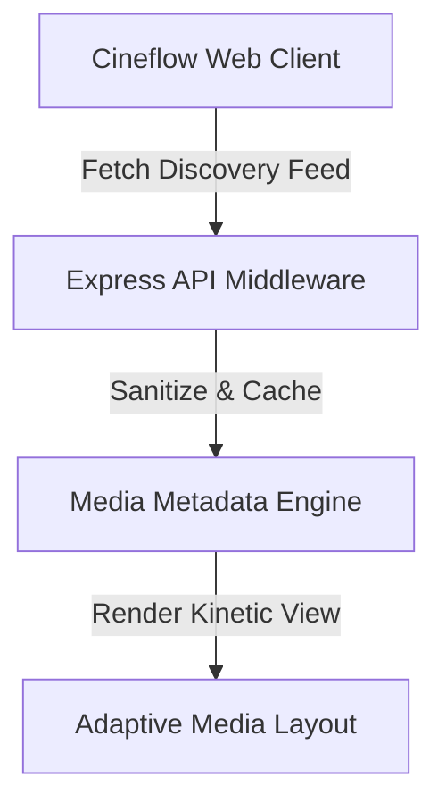
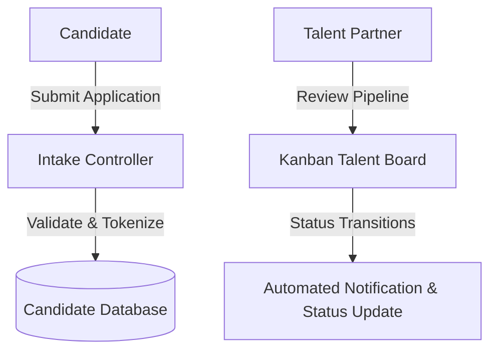

# 💎 Tirth's Engineering Portfolio & System Architecture Showcase

Welcome to my central software engineering and system architecture portfolio. This repository showcases the architectural blueprints, technical case studies, UX design philosophies, and feature walkthroughs of my core production systems.

---

## 🛡️ Intellectual Property & Security Architecture Notice

> **Data & Code Protection Compliance:**  
> In adherence to enterprise intellectual property (IP) protection and client privacy, **production source code, proprietary business algorithms, database connection strings, and server credentials are securely hosted in encrypted Private Repositories**.  
>  
> This public portfolio repository serves as a **transparent architectural showcase**, providing comprehensive technical case studies, system flowcharts, user interface designs, and verified performance metrics without exposing sensitive backend infrastructure.

---

## 🚀 Featured Project Index

| Project Name | Primary Focus | Core Technologies | Architecture Status | Case Study |
| :--- | :--- | :--- | :--- | :--- |
| **AURUM NOIR** | Luxury B2B Wholesale Jewellery & Proforma PO Platform | React 18, Vite, Framer Motion, Vanilla CSS Design System | Production Ready | [View Deep-Dive](./case-studies/01-aurum-noir-b2b.md) |
| **Cineflow** | Real-Time Media Discovery & Streaming Experience | Node.js, Express, Vanilla JS, Dynamic Media Pipelines | Enterprise Prototype | [View Deep-Dive](./case-studies/02-cineflow-streaming.md) |
| **Smart Recruitment Portal** | Enterprise Talent Acquisition, ATS & Pipeline Management | PHP, MySQL, Secure Session Auth, Role-Based Access Control | Production Ready | [View Deep-Dive](./case-studies/03-smart-recruitment-portal.md) |
| **Clinic Management System** | Modern EHR, Doctor OPD Scheduling & Patient Portal | React, TypeScript, Vite, Tailwind CSS, Oxlint | Production Ready | [View Deep-Dive](./case-studies/04-clinic-management-system.md) |
| **Jewelry Industry Digital Roadmap** | Karigar Workshop Supply Chain & Bullion Analytics Blueprint | Vanilla JS, Canvas 2D, Interactive Visual Pipelines | Strategic Roadmap | [View Deep-Dive](./case-studies/05-jewelry-roadmap.md) |

---

## 🏛️ 1. AURUM NOIR: Luxury B2B Imitation Jewellery Platform

> **Live Design System:** *Maison Vendôme (Cashmere Greige `#EDE8E3` & Tuscan Bronze `#6E473B`)*  
> **Key Metric:** Sub-millisecond reactive pricing, zero runtime layout shift, 100% responsive fluid physics.

### Architecture Highlights
- **Architectural Plinth Product Matrix**: Custom 4:5 vertical portrait aspect ratio with high-resolution dual-image crossfades.
- **B2B Tiered Wholesale Margins**: Live dynamic margin calculator displaying recommended retail markup (e.g. `+62% Margin`) and wholesale bulk rates (`₹2,469/pc`).
- **Proforma Purchase Order Vault**: Centralized modal supporting line-item MOQ validations, currency conversions (INR, USD, EUR, GBP, AED), and real-time order proforma generation.
- **Direct Karigar WhatsApp Dispatch**: Instant dispatch pipeline encoding cart items, wholesale totals, and buyer notes directly into WhatsApp encrypted chats.

### Visual Interface Showcase
| Curated B2B Catalogue | High-Definition Product Reel |
| :---: | :---: |
|  |  |

| Editorial Lookbook | Wholesale Proforma PO Vault |
| :---: | :---: |
|  |  |

---

## 🎬 2. Cineflow: Fluid Cinematic Media Discovery

> **Core Objective:** Deliver a Netflix/Apple TV+ grade fluid discovery experience with zero buffering metadata rendering.

### Architecture Highlights
- **Asynchronous Data Feeds**: Ultra-lightweight event-driven API service caching trending films, category taxonomies, and stream metadata.
- **Kinetic Carousel & Motion Mechanics**: Micro-animated carousel transitions with dynamic backdrop blur and responsive movie cards.
- **Watchlist & User Collection Engine**: Client-side reactive persistence ensuring instantaneous bookmarking and playback readiness.

---

## 👥 3. Smart Recruitment Portal: Enterprise ATS & Talent Engine

> **Core Objective:** Provide corporate recruiters with automated pipeline management, candidate tracking, and role-based credentialing.

### Architecture Highlights
- **Role-Based Access Control (RBAC)**: Secure multi-tier authentication separating Recruiters, Hiring Managers, and Candidates.
- **Multi-Stage Applicant Pipeline**: Dynamic state machine advancing applications through *Applied*, *Screening*, *Technical Interview*, *HR Review*, and *Offer Dispatched*.
- **Relational Schema Design**: Highly normalized relational database structuring resumes, evaluation scorecards, vacancy postings, and audit trails.

---

## 🏥 4. Clinic Management System: Modern EHR & Scheduling

> **Core Objective:** Streamline outpatient appointments, doctor consultations, diagnostic suites, and digital prescription lifecycles.

### Architecture Highlights
- **Doctor Consultation Management**: Real-time slot allocation preventing double bookings and managing physician availability across specialties.
- **Electronic Health Records (EHR)**: Secure patient medical history, previous consultations, lab test attachments, and digital prescription archiving.
- **Type-Safe Modern Frontend**: Built with TypeScript, React 18, and Vite, achieving zero linting errors and instant sub-second hot reload.

| Modern Diagnostic Suite | Clinical Experience |
| :---: | :---: |
|  |  |

---

## 🗺️ 5. Jewelry Industry Digital Roadmap

> **Core Objective:** Comprehensive strategic and technological roadmap mapping the digitization of traditional jewellery ateliers.

### Architecture Highlights
- **Karigar Supply Chain Tracking**: Digital ledger bridging traditional hand-craft artisans with corporate B2B distribution hubs.
- **Live Bullion Valuation Pipeline**: Dynamic daily metal and gemstone market adjustment algorithms for precise real-time cost estimation.
- **Omnichannel Expansion Milestones**: Phase-by-phase strategic execution framework detailing CRM integration, augmented reality try-ons, and global logistics.

---

## 📬 Contact & Collaboration

- **GitHub Profile**: [@tirth2907](https://github.com/tirth2907)
- **Email**: [cryptorth2907@gmail.com](mailto:cryptorth2907@gmail.com)
- **Specialization**: Full-Stack Web Development, Enterprise System Design, Luxury E-Commerce, UX Engineering.
