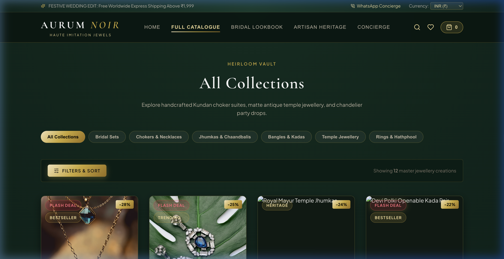
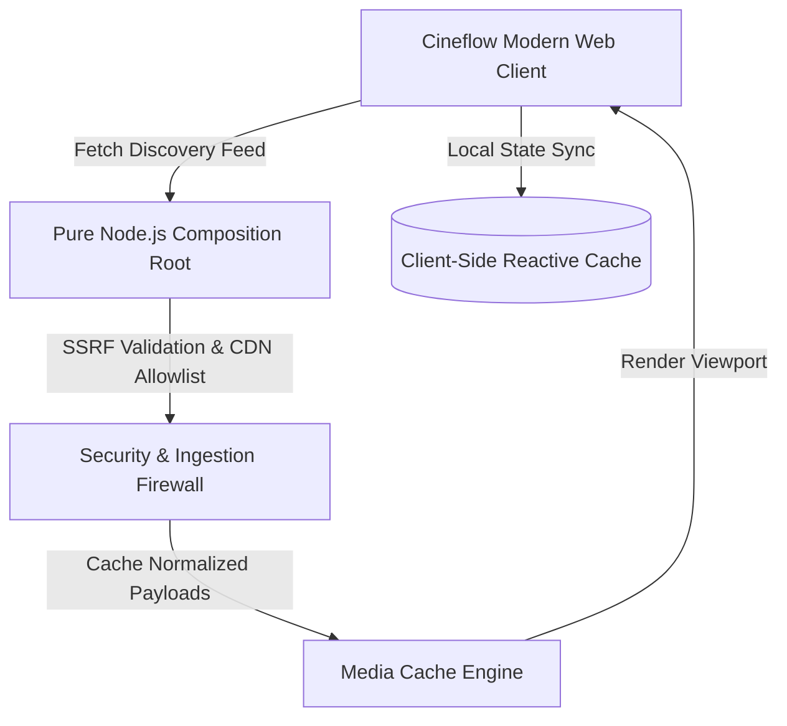
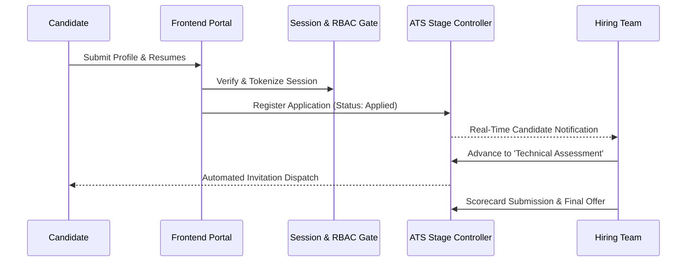
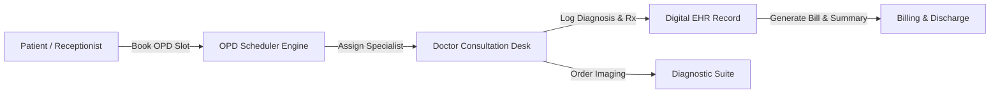
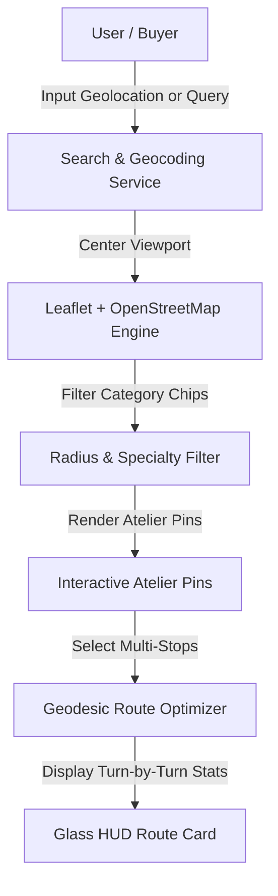

# 🌟 Software Engineering Portfolio & Multi-Project Frontend Showcase

[](#)
[](#)
[](#)
[](#)
[](https://github.com/tirth2907)

Welcome to my central **Software Engineering Portfolio and Multi-Project Showcase**. 

This monorepo houses the complete **client-side frontend codebases, architectural blueprints, interactive case studies, design system tokens, and UI walkthroughs** for my five primary production systems.

---

## 🧭 Navigation & Project Directory

Jump directly to the interactive case study or browse the client-side frontend code for each project:

| # | Project Name | Primary Domain | Core Stack | Case Study View | Live Frontend Code |
| :-: | :--- | :--- | :--- | :-: | :-: |
| **01** | **AURUM NOIR** | Luxury B2B Imitation Jewellery Platform | React 18, Vite, Framer Motion, Maison Vendôme CSS | [📖 Case Study](./projects/01-aurum-noir-b2b-jewellery/README.md) | [💻 Source Code](./projects/01-aurum-noir-b2b-jewellery/frontend/) |
| **02** | **Cineflow** | Cinematic Streaming & Discovery Hub | Vanilla ES6 JS, Cinema Dark Theme, Kinetic Carousels | [📖 Case Study](./projects/02-cineflow-streaming/README.md) | [💻 Source Code](./projects/02-cineflow-streaming/frontend/) |
| **03** | **Smart Recruitment** | Enterprise Applicant Tracking System (ATS) | Custom CSS, Plus Jakarta Sans, Glow UI, HTML5 | [📖 Case Study](./projects/03-smart-recruitment-portal/README.md) | [💻 Source Code](./projects/03-smart-recruitment-portal/frontend/) |
| **04** | **Clinic Management** | Modern Healthcare EHR & OPD Suite | React 19, TypeScript, Tailwind CSS, Tabler Icons | [📖 Case Study](./projects/04-clinic-management-system/README.md) | [💻 Source Code](./projects/04-clinic-management-system/frontend/) |
| **05** | **Jewelry Explorer** | Spatial Web GIS & Atelier Route Navigator | Leaflet.js, OpenStreetMap, Zero-API-Key Engine | [📖 Case Study](./projects/05-jewelry-shop-explorer/README.md) | [💻 Source Code](./projects/05-jewelry-shop-explorer/frontend/) |

---

## 🛡️ Intellectual Property & Dual-Track Security Architecture

```mermaid
graph TD
    subgraph Public Monorepo [github.com/tirth2907/project-case-studies (Public)]
        UI1[AURUM NOIR Frontend]
        UI2[Cineflow Modern Web Client]
        UI3[Smart Recruitment UI Templates]
        UI4[Clinic Management TypeScript Components]
        UI5[Jewelry Explorer Leaflet GIS App]
        Docs[System Architecture & Case Studies]
    end

    subgraph Private Vaults [100% Private GitHub Repositories]
        Priv1[(B2B Wholesale Margins & Supplier Contracts)]
        Priv2[(Node.js Composition Root & Streaming Proxies)]
        Priv3[(MySQL Database Credentials & Relational Schemas)]
        Priv4[(Patient EHR Schemas & Clinical Datasets)]
        Priv5[(Proprietary Routing Models & Bullion Spot Feeds)]
    end

    Public Monorepo -.->|Inspect UI & Craftsmanship| Reviewers[Recruiters & Engineers]
    Private Vaults -.->|Encrypted & Restricted| Owner[Only tirth2907]
```

> [!NOTE]
> **Enterprise Privacy Policy:**  
> All client-side frontend implementations, responsive stylesheets, interactive components, and UX blueprints are openly published in this repository for evaluation. Proprietary backend server logic, relational SQL database structures (`schema.sql`), server connection credentials (`db.php`), and internal endpoints remain securely preserved in **Private Repositories**.

---

## 💎 01. AURUM NOIR: Luxury B2B Imitation Jewellery Platform

> **Live Design System:** *Maison Vendôme (Cashmere Greige `#EDE8E3` & Tuscan Bronze `#6E473B`)*  
> **Key Metric:** Sub-millisecond reactive calculations, zero layout shift, 100% fluid responsive physics.

AURUM NOIR is an haute-couture B2B digital showroom engineered for high-volume imitation and fine jewellery distributors. It bridges traditional karigar craftsmanship with enterprise procurement mechanics.

```mermaid
graph LR
    Buyer[B2B Wholesale Buyer] -->|Browse Curated Catalogue| Plinth[Architectural Plinth Cards]
    Plinth -->|Select Pack MOQ| Drawer[Tuscan Bronze Quick Drawer]
    Drawer -->|Batch Quantity Increment| Bag[Purchase Order Bag]
    Bag -->|Open Financial Review| Vault[Centered Proforma PO Vault]
    Vault -->|Direct Dispatch| WhatsApp[WhatsApp Karigar Beacon & PDF Dispatch]
```



### Key Engineering Highlights
- **Architectural Plinth Cards**: 4:5 vertical portrait aspect ratio with dual-image crossfades, slide-up Tuscan Bronze drawer, bulk rates (`₹2,469/pc`), and live retail gross profit margins (`+62% Margin`).
- **Centered Proforma PO Vault**: Converted from edge slide-drawers into a grand, centered 2-column modal handling pack MOQ rules, live subtotal adjustments, and multi-currency conversions (INR ₹, USD $, EUR €, GBP £, AED د.إ).
- **Classic Karigar WhatsApp Dispatch**: Restored classic emerald button (`#1F6B3E`) with an active pulsating beacon dot.
- 📂 **Frontend Code**: [`projects/01-aurum-noir-b2b-jewellery/frontend/`](./projects/01-aurum-noir-b2b-jewellery/frontend/)
- 📖 **Case Study**: [`projects/01-aurum-noir-b2b-jewellery/README.md`](./projects/01-aurum-noir-b2b-jewellery/README.md)

| Curated B2B Catalogue | Proforma PO Checkout |
| :---: | :---: |
|  |  |

---

## 🎬 02. Cineflow: Ultra-Premium Streaming Web Architecture

> **Core Objective:** Deliver a cinematic, fluid entertainment discovery experience comparable to Apple TV+ and Netflix.

Cineflow is an interactive streaming discovery platform emphasizing zero-latency categorization, reactive search indexing, and kinetic browsing flows.



### Key Engineering Highlights
- **Kinetic Carousel Controllers**: Frictionless horizontal scrolling controllers with momentum acceleration and deceleration curves.
- **Dynamic Palette Extraction**: Automatic backdrop gradient generation sampled from movie poster key art.
- **Multi-Server Streaming Selector**: Instantaneous stream switching with zero UI re-rendering.
- 📂 **Frontend Code**: [`projects/02-cineflow-streaming/frontend/`](./projects/02-cineflow-streaming/frontend/)
- 📖 **Case Study**: [`projects/02-cineflow-streaming/README.md`](./projects/02-cineflow-streaming/README.md)

---

## 👥 03. Smart Recruitment Portal: Enterprise ATS & Talent Engine

> **Core Objective:** Provide corporate recruiters with automated pipeline management, candidate tracking, and role-based credentialing.

The Smart Recruitment Portal is a corporate hiring management platform built to streamline the recruitment lifecycle from initial job requisition to final candidate onboarding.



### Key Engineering Highlights
- **Role-Based Access Control (RBAC)**: Multi-tier permission separation between HR Administrators, Department Interviewers, and Candidates.
- **Multi-Stage Pipeline State Machine**: Structured lifecycle progression (`Applied` -> `Resume Screening` -> `Technical Assessment` -> `Executive Review` -> `Offer Dispatched`).
- **Interactive Recruiter Dashboard**: High-contrast KPI dashboard displaying vacancy fulfillment velocity, department requisitions, and candidate review queues.
- 📂 **Frontend Code**: [`projects/03-smart-recruitment-portal/frontend/`](./projects/03-smart-recruitment-portal/frontend/)
- 📖 **Case Study**: [`projects/03-smart-recruitment-portal/README.md`](./projects/03-smart-recruitment-portal/README.md)

---

## 🏥 04. Clinic Management System: Modern Healthcare EHR

> **Core Objective:** Modernize outpatient department (OPD) bookings, clinical consults, and diagnostic imaging workflows.

Built with React 19, TypeScript, and Tailwind CSS, this system provides clinical practices with an intuitive, privacy-conscious electronic health record interface.



### Key Engineering Highlights
- **Type-Safe React 19 & TypeScript Frontend**: Strict type safety across patient profiles, doctor encounter records, and diagnostic reports.
- **OPD Booking & Scheduling Engine**: Real-time slot allocation preventing physician overbooking across clinical specialties.
- **Diagnostic & Consultation Suite**: Integrated laboratory test viewer, radiology imaging attachments, and medication prescription builder.
- 📂 **Frontend Code**: [`projects/04-clinic-management-system/frontend/`](./projects/04-clinic-management-system/frontend/)
- 📖 **Case Study**: [`projects/04-clinic-management-system/README.md`](./projects/04-clinic-management-system/README.md)

| Modern Diagnostic Suite | Clinical Experience |
| :---: | :---: |
|  |  |

---

## ✨ 05. Jewelry Atelier Explorer & Route Navigator

> **Core Objective:** Discover, filter, and navigate between fine jewelry ateliers, silversmiths, and bullion artisans using 100% open-source spatial GIS.

An interactive web GIS application providing walking/driving route generation and discovery across luxury jewelry districts with zero external API key dependencies.



### Key Engineering Highlights
- **100% Zero-API-Key Spatial Navigation**: Built with Leaflet.js and OpenStreetMap vector tiles, eliminating third-party quota limits and billing locks.
- **Geodesic Multi-Stop Route Optimizer**: Computes real-time walking distances, travel durations, and waypoint sequences between selected atelier stops.
- **Glassmorphic HUD Overlay**: Dynamic turn-by-turn route summary card and live search radius adjustments.
- 📂 **Frontend Code**: [`projects/05-jewelry-shop-explorer/frontend/`](./projects/05-jewelry-shop-explorer/frontend/)
- 📖 **Case Study**: [`projects/05-jewelry-shop-explorer/README.md`](./projects/05-jewelry-shop-explorer/README.md)

| Interactive Atelier Route Navigator |
| :---: |
|  |

---

## 🛠️ Local Developer Quickstart

To run any of the client frontend applications on your local machine:

### 1. AURUM NOIR (React 18 + Vite)
```bash
cd projects/01-aurum-noir-b2b-jewellery/frontend
npm install
npm run dev
# Open http://localhost:5173
```

### 2. Cineflow (Vanilla ES6 JavaScript)
```bash
cd projects/02-cineflow-streaming/frontend
# Simply open in browser or run a lightweight local static server:
npx serve .
# or
python3 -m http.server 8080
```

### 3. Smart Recruitment Portal (HTML5 & Custom CSS)
```bash
cd projects/03-smart-recruitment-portal/frontend
# Open index.html directly in any browser:
open index.html
```

### 4. Clinic Management System (React 19 + TypeScript + Vite)
```bash
cd projects/04-clinic-management-system/frontend
npm install
npm run dev
# Open http://localhost:5173
```

### 5. Jewelry Atelier Explorer (Leaflet.js + OpenStreetMap)
```bash
cd projects/05-jewelry-shop-explorer/frontend
# Open index.html directly in any browser:
open index.html
```

---

## 📬 Contact & Inquiries

- **Author**: Tirth ([@tirth2907](https://github.com/tirth2907))
- **Email**: [cryptorth2907@gmail.com](mailto:cryptorth2907@gmail.com)
- **Specializations**: Full-Stack Web Development, Enterprise System Design, Luxury E-Commerce, UX Engineering.
