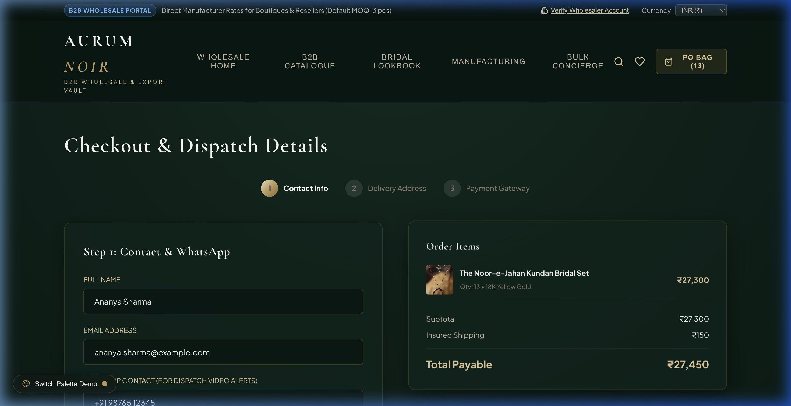

# 🌟 Unified Frontend & Engineering Case Studies Portfolio

Welcome to my central **Frontend Architecture & Engineering Case Studies Showcase**. 

This single unified public repository contains the complete **client-side frontend codebases, interactive case studies, design system tokens, and architectural blueprints** for all five of my primary production-grade systems.

---

## 🛡️ Architecture & IP Protection Structure

> **Enterprise Privacy Compliance:**  
> - **Frontend Presentation Code**: Full interactive frontend components, client logic, and styling systems are published directly in this repository for public review, inspection, and demonstration.
> - **Backend & Database Isolation**: Proprietary backend microservices, database connection strings (`db.php`), relational SQL schemas (`schema.sql`), and server endpoints are securely isolated inside **100% Private Repositories**.

---

## 🚀 Projects Directory: Frontend Code & Case Study Index

| # | Project Name | Tech Stack | Case Study View | Live Frontend Code |
| :---: | :--- | :--- | :---: | :---: |
| **01** | **AURUM NOIR** Haute-Couture B2B Imitation Jewellery Platform | React 18, Vite, Framer Motion, Maison Vendôme CSS | [📖 View Case Study](./projects/01-aurum-noir-b2b-jewellery/README.md) | [💻 Explore Frontend Code](./projects/01-aurum-noir-b2b-jewellery/frontend/) |
| **02** | **Cineflow** Ultra-Premium Cinematic Streaming Discovery | Vanilla ES6 JavaScript, Cinema Dark UI, Kinetic Carousels | [📖 View Case Study](./projects/02-cineflow-streaming/README.md) | [💻 Explore Frontend Code](./projects/02-cineflow-streaming/frontend/) |
| **03** | **Smart Recruitment Portal** Enterprise Applicant Tracking System (ATS) | Custom CSS, Plus Jakarta Sans, Glow UI, HTML5 | [📖 View Case Study](./projects/03-smart-recruitment-portal/README.md) | [💻 Explore Frontend Code](./projects/03-smart-recruitment-portal/frontend/) |
| **04** | **Clinic Management System** Modern Healthcare EHR & OPD Consultation Suite | React 19, TypeScript, Tailwind CSS, Tabler Icons | [📖 View Case Study](./projects/04-clinic-management-system/README.md) | [💻 Explore Frontend Code](./projects/04-clinic-management-system/frontend/) |
| **05** | **Jewelry Atelier Explorer** Spatial Web GIS & Multi-Stop Route Navigator | Leaflet.js, OpenStreetMap, Zero-API-Key Engine | [📖 View Case Study](./projects/05-jewelry-shop-explorer/README.md) | [💻 Explore Frontend Code](./projects/05-jewelry-shop-explorer/frontend/) |

---

## 💎 Project 01: AURUM NOIR (B2B Imitation Jewellery)
- **Live Design System**: *Maison Vendôme (Cashmere Greige `#EDE8E3` & Tuscan Bronze `#6E473B`)*
- **Key Modules**:
  - **The Architectural Plinth**: 4:5 portrait frame with dual-image crossfade, slide-up Tuscan Bronze quick drawer, bulk rates (`₹2,469/pc`), and live retail gross profit margins (`+62% Margin`).
  - **Centered Proforma PO Vault**: Grand 2-column modal handling pack MOQ rules, multi-currency conversions (INR, USD, EUR, GBP, AED), and real-time proforma invoice generation.
  - **Direct Karigar WhatsApp Dispatch**: Classic emerald button (`#1F6B3E`) with a live pulsing presence indicator.
- 📁 **Browse Code**: [`projects/01-aurum-noir-b2b-jewellery/frontend/`](./projects/01-aurum-noir-b2b-jewellery/frontend/)
- 📖 **Full Case Study**: [`projects/01-aurum-noir-b2b-jewellery/README.md`](./projects/01-aurum-noir-b2b-jewellery/README.md)

| Curated B2B Catalogue | Proforma PO Checkout |
| :---: | :---: |
|  |  |

---

## 🎬 Project 02: Cineflow (Cinematic Streaming Engine)
- **Frontend Architecture**: Pure Vanilla JavaScript with modular ES6 components, dynamic background blur extraction from movie posters, and kinetic horizontal carousels.
- **Key Modules**:
  - Kinetic browsing feeds with momentum acceleration curves.
  - Responsive multi-server video player with instant stream switching.
  - Optimistic client-side watchlist persistence.
- 📁 **Browse Code**: [`projects/02-cineflow-streaming/frontend/`](./projects/02-cineflow-streaming/frontend/)
- 📖 **Full Case Study**: [`projects/02-cineflow-streaming/README.md`](./projects/02-cineflow-streaming/README.md)

---

## 👥 Project 03: Smart Recruitment Portal (Enterprise ATS)
- **Frontend Architecture**: Custom recruitment design system with dark gradients, glow cards, and typography powered by Plus Jakarta Sans.
- **Key Modules**:
  - Real-time recruiter KPI dashboard (Active Candidates, Open Requisitions, Avg Time-to-Hire).
  - Multi-stage pipeline board (`Applied` -> `Resume Screening` -> `Technical Assessment` -> `Executive Review` -> `Offer Dispatched`).
- 📁 **Browse Code**: [`projects/03-smart-recruitment-portal/frontend/`](./projects/03-smart-recruitment-portal/frontend/)
- 📖 **Full Case Study**: [`projects/03-smart-recruitment-portal/README.md`](./projects/03-smart-recruitment-portal/README.md)

---

## 🏥 Project 04: Clinic Management System (Modern EHR)
- **Frontend Architecture**: React 19 + TypeScript with strict type annotations, Tailwind CSS, and Framer Motion micro-interactions.
- **Key Modules**:
  - Doctor OPD appointment booking engine with slot conflict resolution.
  - Electronic health record (EHR) viewer with structured history, vitals, and diagnostic image attachments.
- 📁 **Browse Code**: [`projects/04-clinic-management-system/frontend/`](./projects/04-clinic-management-system/frontend/)
- 📖 **Full Case Study**: [`projects/04-clinic-management-system/README.md`](./projects/04-clinic-management-system/README.md)

| Diagnostic Suite | Clinical Experience |
| :---: | :---: |
|  |  |

---

## ✨ Project 05: Jewelry Atelier Explorer & Route Navigator
- **Frontend Architecture**: Spatial Web GIS engine built with Leaflet and OpenStreetMap, requiring 100% zero external API keys.
- **Key Modules**:
  - Real-time search radius slider with category filter chips (Fine Jewelry, Silversmiths, Bullion Ateliers).
  - Dynamic geodesic route optimizer calculating multi-stop distance and journey duration.
  - Glassmorphic HUD overlay displaying turn-by-turn waypoint stats.
- 📁 **Browse Code**: [`projects/05-jewelry-shop-explorer/frontend/`](./projects/05-jewelry-shop-explorer/frontend/)
- 📖 **Full Case Study**: [`projects/05-jewelry-shop-explorer/README.md`](./projects/05-jewelry-shop-explorer/README.md)

---

## 📬 Contact & Inquiries

- **Author**: Tirth ([@tirth2907](https://github.com/tirth2907))
- **Email**: [cryptorth2907@gmail.com](mailto:cryptorth2907@gmail.com)
- **Specialization**: Full-Stack Architecture, Enterprise Front-End Systems, UX Engineering.
