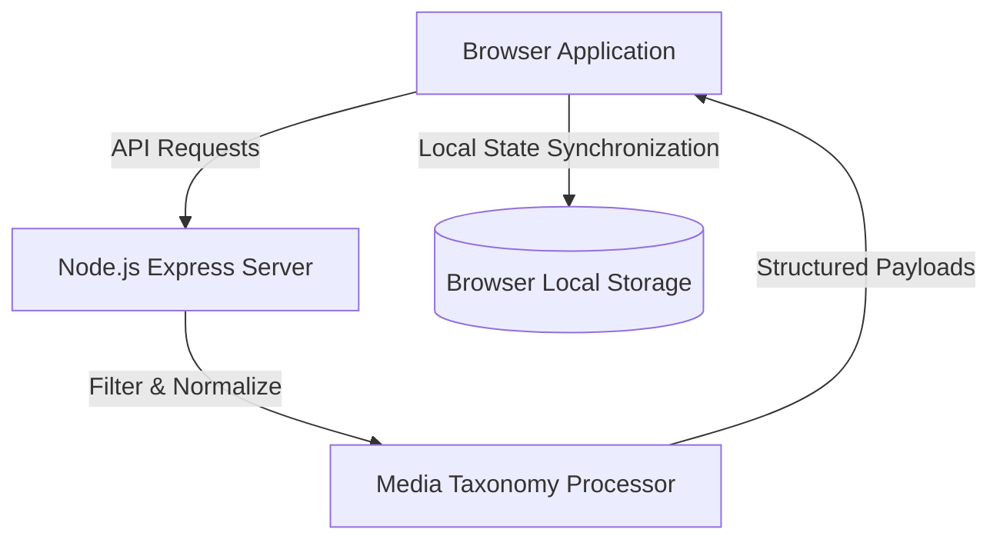

# Case Study: Cineflow — Cinematic Media Streaming & Discovery Engine

## Executive Summary
**Cineflow** is an interactive movie discovery and entertainment streaming hub designed to emulate the fluid browsing mechanics of premier digital streaming platforms. The architecture emphasizes rapid content categorization, reactive search indexing, and kinetic browsing flows.

---

## 🎯 Architecture & User Experience Objectives
- **Zero-Latency Content Discovery**: Cached media catalogues allowing instant browsing across genres, top rated, and newly released films.
- **Cinematic Detail Overlays**: Engaging hero trailers, dynamic background gradients sampled from movie key art, and rich cast/crew breakdowns.
- **Client-Side Collections**: Instantaneous watchlist management with optimistic UI updates and local persistence.

---

## 🛠️ System Architecture

### Key Technical Innovations
1. **Adaptive Media Layout**: Responsive CSS grid adapting gracefully from ultra-wide 4K cinema displays down to mobile viewports.
2. **Kinetic Carousel Controllers**: Frictionless horizontal scrolling controllers with smooth acceleration and deceleration curves.
3. **Optimized Asset Delivery**: Dynamic image loading pipelines serving responsive poster and backdrop resolutions to preserve client memory and bandwidth.

---

## 🔒 Intellectual Property & Backend Security
The production backend server logic, API secret keys, external streaming distributor feeds, and license verification modules remain securely locked in private repository vaults.
