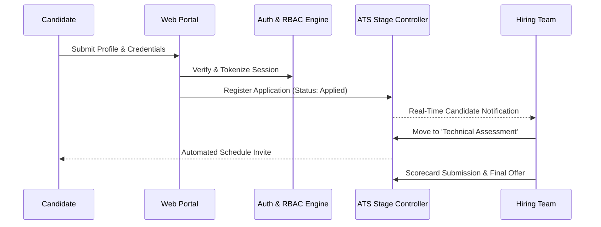

# Case Study: Smart Recruitment Portal — Enterprise Applicant Tracking System

## Executive Summary
**Smart Recruitment Portal** is an enterprise-grade Applicant Tracking System (ATS) and talent pipeline management solution. Engineered to streamline the corporate hiring lifecycle, it equips recruiters and hiring managers with automated candidate workflows, role-based access management, and hiring stage transitions.

---

## 🏛️ System Architecture & Entity Flow

---

## ⚙️ Core Technical Capabilities

### 1. Role-Based Access Control (RBAC)
- Strict multi-tiered authentication ensuring complete data isolation between external applicants, internal department leads, and corporate HR administrators.
- Secure session tokens, password hashing with cryptographic salts, and input sanitization routines mitigating XSS and SQL injection risks.

### 2. Multi-Stage Pipeline State Machine
- Structured progression stages: `Applied` -> `Resume Screened` -> `Technical Interview` -> `Leadership Review` -> `Offer Extended` -> `Hired`.
- Centralized recruiter dashboard with quick-action status toggles, candidate filtering by skills and experience, and scorecard tracking.

### 3. Normalized Relational Database Architecture
- Efficient relational schema linking applicants, job requisitions, departmental vacancies, interviewer scorecards, and audit logs.

---

## 🔒 Intellectual Property & Backend Security
The production database schema (`schema.sql`), database connection credentials (`db.php`), corporate applicant records, and internal recruiter logic are securely maintained in 100% private repositories.
