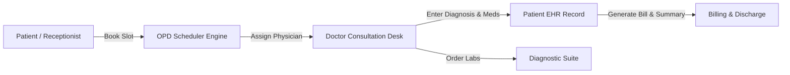

# Case Study: Clinic Management System — Modern EHR & Consultation Platform

## Executive Summary
**Clinic Management System** is a healthcare electronic health record (EHR) and clinical workflow application built for modern medical centers and private practices. It simplifies outpatient department (OPD) scheduling, patient profile records, physician consult tracking, and diagnostic test tracking into an intuitive, HIPAA/privacy-conscious user interface.

---

## 🏥 Clinical Architecture & Core Modules

---

## 🛠️ Technology Stack & Engineering Standards
- **Frontend Architecture**: React 18 with TypeScript for complete type safety and robust refactoring guarantees.
- **Styling & UI Components**: Tailwind CSS combined with custom luxury medical design tokens, yielding clean readability and high clinical contrast.
- **Code Quality & Performance**: Oxlint linting integration, zero bundle bloat, and sub-second page loads powered by Vite.

---

## 🔒 Intellectual Property & Backend Security
All patient health records, diagnostic imaging datasets, doctor credentialing records, and hospital administration server routines are strictly protected inside private repository repositories.
