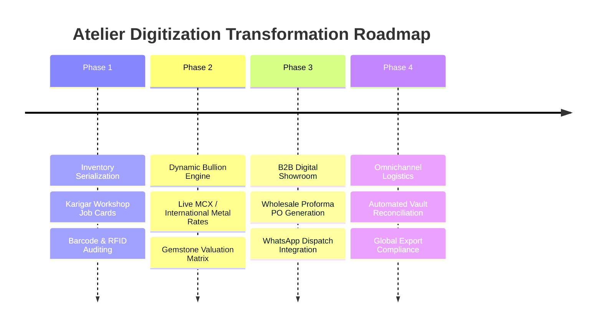

# Case Study: Jewelry Industry Digital Roadmap & Atelier Framework

## Executive Summary
The **Jewelry Industry Digital Roadmap** is a strategic and architectural technology framework designed to guide traditional jewellery manufacturers and ateliers through end-to-end digital transformation. It unifies karigar workshop logistics, bullion spot-pricing dynamics, and omnichannel distribution milestones into an interactive operational model.

---

## 🗺️ Transformation Phases & Architecture

---

## 🛠️ Key Architectural Pillars
1. **Atelier Job-Work & Karigar Ledger**: Real-time batch tracking of raw metal, stone wastage calculation, and artisan labour reconciliation.
2. **Dynamic Bullion Pricing Feed**: Real-time recalculation of finished jewellery unit costs factoring in daily metal fluctuation rates.
3. **Interactive Visual Dashboard**: Canvas 2D timeline and milestones visualizer providing high-level operational visibility for executive leadership.

---

## 🔒 Intellectual Property & Backend Security
Detailed strategic blueprints, proprietary manufacturing yield formulas, and supply chain partner details are safely secured in private repositories.
