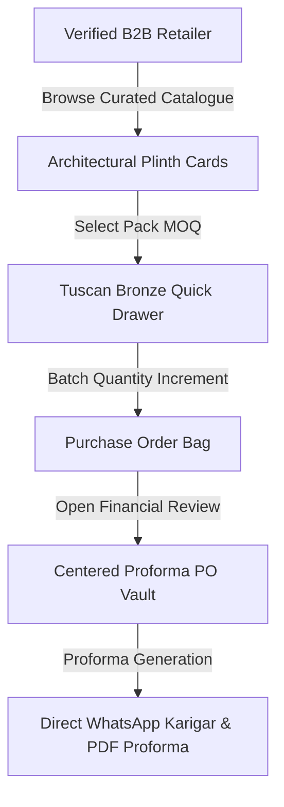
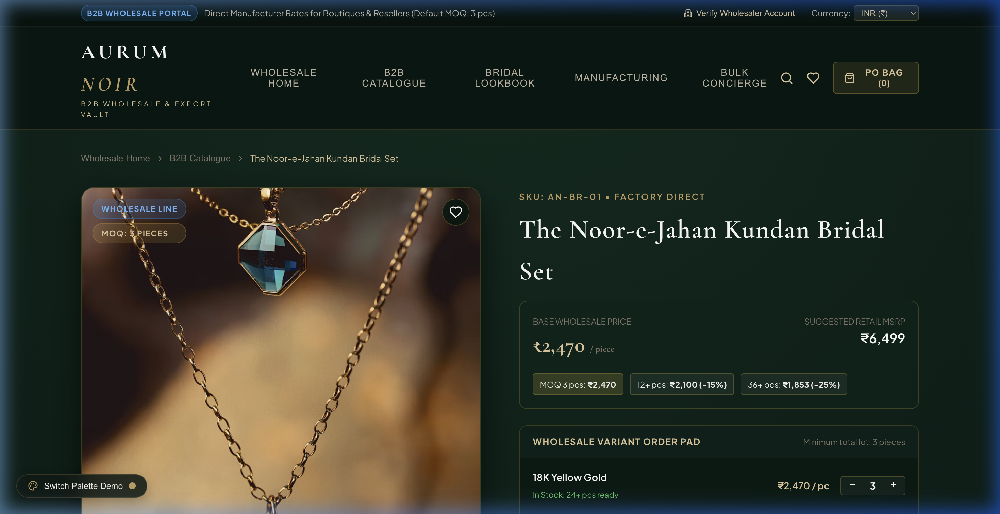
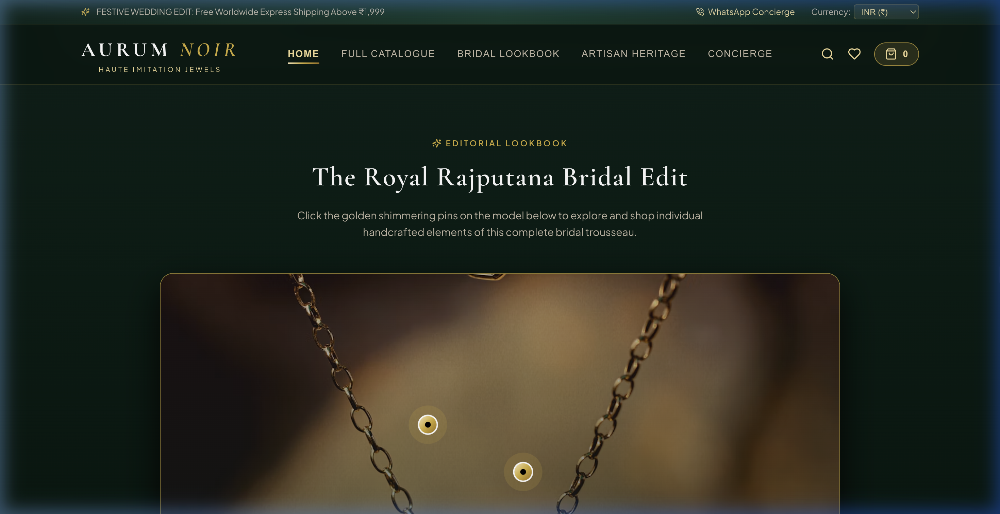

# 💎 Case Study: AURUM NOIR — Haute-Couture B2B Imitation Jewellery Platform

> **Architectural Case Study**: AURUM NOIR is an haute-couture B2B digital wholesale platform designed specifically for high-volume imitation and fine jewellery distributors. It unifies traditional Indian karigar craftsmanship with modern enterprise procurement mechanics.

---

## 🛡️ Intellectual Property Notice
*Proprietary wholesale pricing algorithms, margin formulas, supplier contracts, and database records are securely hosted in a Private Repository. This public repository serves as the official architectural blueprint, UX specification, and visual case study.*

---

## 🎨 Design System: "Maison Vendôme"

AURUM NOIR operates on a bespoke, hyper-tailored design philosophy rooted in Cashmere Greige and Tuscan Bronze.

| Design Token | Color Hex | Psychological & Brand Purpose |
| :--- | :--- | :--- |
| **Cashmere Greige** | `#EDE8E3` | Primary structural canvas evoking Parisian limestone, raw parchment, and brushed cashmere. |
| **Tuscan Bronze** | `#6E473B` | Structural contrast and typography evoking hand-rubbed Florentine bronze. |
| **Florentine Gold** | `#C8A84E` | Micro-shimmer accents, luxury tier star badges, and interactive feedback highlights. |
| **Surface Card Elevation** | `#F5F2EE` | Layered depth with warm ambient shadows (`0 12px 36px rgba(44, 24, 16, 0.08)`). |
| **Karigar WhatsApp Beacon** | `#1F6B3E` | Restored classic emerald with a live pulsing presence indicator for instant artisan dispatch. |

---

## 🏛️ Core Architectural Modules

### 1. The Architectural Plinth (Product Cards)
- **Aspect Ratio**: 4:5 vertical portrait frame maximizing detail view for bridal chokers, necklaces, and temple jewellery.
- **Dual-Image Crossfade**: Smooth opacity transition on hover displaying reverse craftsmanship and clasp finishing.
- **B2B Tier Margin Indicator**: Real-time margin calculator displaying estimated retail markup (`+62% Margin`) beside bulk wholesale piece rates (`₹2,469/pc`).
- **Slide-Up Quick Drawer**: Slide-up Tuscan Bronze drawer allowing rapid bulk selection (`5 / 10 / 25 / 50 pcs`) without leaving the catalogue view.

### 2. Centered Proforma Purchase Order Vault
- Converted from edge slide-drawers into a grand, centered dual-column modal.
- **Left Column**: High-density line-item breakdown with pack MOQ validation, metal finish toggles, and live piece count adjustments.
- **Right Column (Financial Summary)**: Real-time wholesale subtotal calculation, automated B2B volume tier discount deduction, applicable GST/customs computations, and direct WhatsApp proforma dispatch button.

---

## 📸 Visual Showcase

| Curated B2B Catalogue | High-Definition Product Reel |
| :---: | :---: |
|  |  |

| Editorial Lookbook | Wholesale Proforma PO Vault |
| :---: | :---: |
|  |  |

---

## 🛠️ Technology Stack
- **Framework**: React 18, Vite
- **Styling Architecture**: Strict Vanilla CSS Tokens (`variables.css` + `global.css`)
- **Animation & Physics**: Framer Motion
- **Currency Engine**: Dynamic client-side exchange rate matrix (INR ₹, USD $, EUR €, GBP £, AED د.إ)

---

## 📬 Contact & Author
- **Author**: Tirth ([@tirth2907](https://github.com/tirth2907))
- **Email**: [cryptorth2907@gmail.com](mailto:cryptorth2907@gmail.com)
