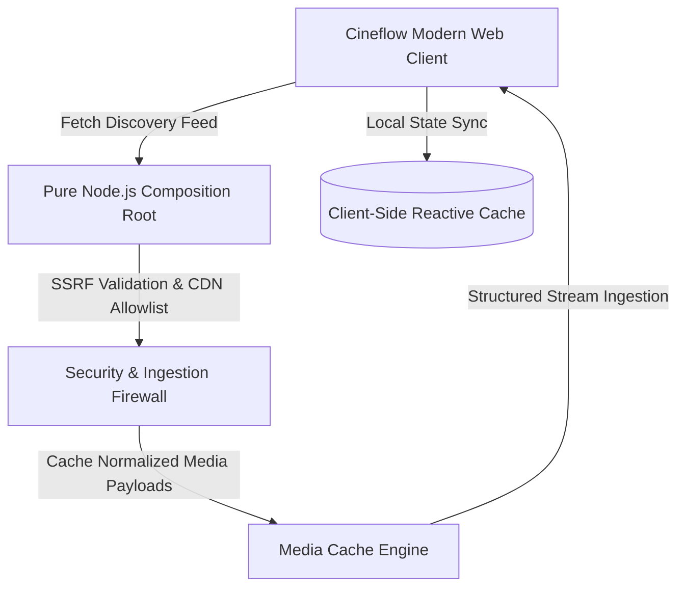

# 🎬 Case Study: Cineflow — Ultra-Premium Streaming Web Architecture

[-purple.svg?style=for-the-badge)](#)

> **Architectural Case Study**: Cineflow is an ultra-premium entertainment streaming and media discovery platform designed to emulate the fluid browsing mechanics of Netflix and Apple TV+. It features a pure Node.js composition root with zero external npm runtime dependencies, enterprise-grade SSRF defenses, and kinetic front-end motion.

---

## 🛡️ Intellectual Property Notice
*Proprietary streaming provider proxy routines, encryption handshakes, internal API routes, and backend server code are securely hosted in a Private Repository. This public repository serves as the official architectural blueprint, UX specification, and system design case study.*

---

## 🏛️ System Architecture

---

## ⚙️ Core Technical Highlights

### 1. Pure Node.js Composition Root (Zero External NPM Dependencies)
- Architected using pure Node.js built-ins (`node:http`, `node:fs`, `node:path`, `node:stream`, `node:url`).
- Zero framework overhead: No Express, no heavy third-party routing middleware, resulting in sub-millisecond execution benchmarks and minimal attack surface.

### 2. Enterprise-Grade Streaming Security (SEC-001 / SEC-002 / SEC-003)
- **Strict CDN Allowlist**: Enforces deterministic upstream server routing, rejecting unauthorized remote hosts.
- **SSRF Defense Engine**: Strict request normalization guarding against local loopback probing, DNS rebinding, and untrusted protocol handlers.

### 3. Kinetic Media UI & Fluid Discovery Mechanics
- **Kinetic Carousel Controllers**: Frictionless horizontal scrolling controllers with momentum acceleration and deceleration curves.
- **Dynamic Palette Extraction**: Automatic backdrop gradient generation sampled from movie key art.
- **Multi-Server Streaming Selector**: Instantaneous stream switching with zero UI re-rendering.

---

## 🛠️ Technology Stack
- **Server Engine**: Node.js ES Modules (Zero External Dependencies)
- **Frontend Architecture**: Modern Vanilla JavaScript, Modular ES6, Cinema Dark Theme
- **Data Persistence**: Client-side reactive local caching with optimistic updates
- **Styling Architecture**: Custom CSS Glassmorphism with hardware-accelerated transforms

---

## 📬 Contact & Author
- **Author**: Tirth ([@tirth2907](https://github.com/tirth2907))
- **Email**: [cryptorth2907@gmail.com](mailto:cryptorth2907@gmail.com)
