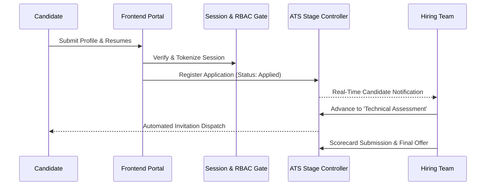

# 👥 Case Study: Smart Recruitment Portal — Enterprise Applicant Tracking System

> **Architectural Case Study**: The Smart Recruitment Portal is a corporate hiring management platform built to streamline the recruitment lifecycle from job requisition to candidate onboarding. It features automated stage transitions, role-based access management, and structured evaluation scorecards.

---

## 🛡️ Intellectual Property Notice
*Proprietary database schemas (`schema.sql`), database connection credentials (`db.php`), internal applicant records, and corporate interview scorecards are securely hosted in a Private Repository. This public repository provides the frontend presentation UI, system flowcharts, and architectural case study.*

---

## 🏛️ System Architecture & Recruitment Flow

---

## ⚙️ Core Technical Highlights

### 1. Role-Based Access Control (RBAC)
- Multi-tier role permissions separating HR Administrators, Department Interviewers, and External Candidates.
- Cryptographically salted password hashing and secure tokenized sessions mitigating credential leakage risks.

### 2. Multi-Stage Pipeline State Machine
- Lifecycle progression stages: `Applied` -> `Resume Screening` -> `Technical Assessment` -> `Executive Interview` -> `Offer Extended` -> `Hired`.
- Real-time recruiter KPI dashboard tracking vacancy fulfillment velocity and candidate drop-off metrics.

### 3. Frontend Experience & Design
- Custom responsive styling with dark gradients, glow cards, and typography powered by Plus Jakarta Sans.
- Interactive candidate status pills and evaluation matrices.

---

## 📁 Repository Contents
- [`frontend/index.html`](./frontend/index.html) — Interactive talent pipeline dashboard demo
- [`frontend/style.css`](./frontend/style.css) — Custom recruitment design tokens and glow UI styling

---

## 📬 Contact & Author
- **Author**: Tirth ([@tirth2907](https://github.com/tirth2907))
- **Email**: [cryptorth2907@gmail.com](mailto:cryptorth2907@gmail.com)
