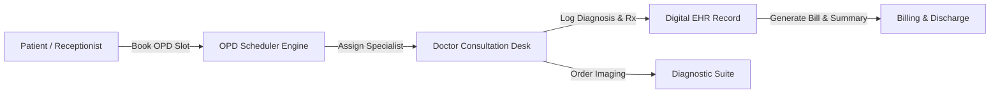
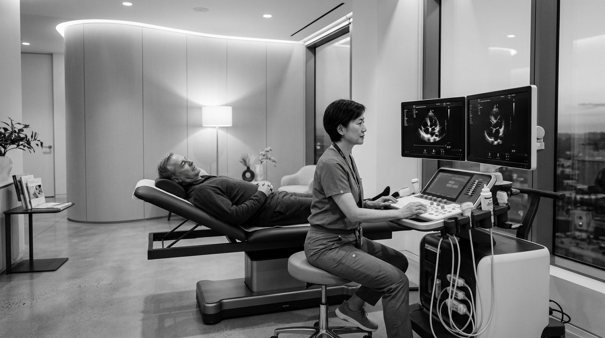

# 🏥 Case Study: Clinic Management System — Modern EHR & Consultation Suite

> **Architectural Case Study**: The Clinic Management System is a clinical workflow and electronic health record (EHR) web application built with React 19 and TypeScript. It streamlines outpatient department (OPD) bookings, physician consultations, diagnostic attachments, and patient medical histories.

---

## 🛡️ Intellectual Property Notice
*Sensitive electronic health records (EHR), physician consultation models, patient diagnostic logs, and internal clinical algorithms are securely preserved inside a Private Repository. This public repository provides the complete client-side TypeScript frontend codebase, UI components, and architectural blueprints.*

---

## 🏛️ Clinical Architecture Flow

---

## ⚙️ Core Technical Highlights

### 1. Type-Safe React 19 & TypeScript Frontend
- Full type safety across medical patient profiles, doctor encounter objects, and diagnostic reports.
- Sub-second hot module replacement powered by Vite and verified with Oxlint linting rules.

### 2. Clinical Scheduling & OPD Booking Engine
- Dynamic slot allocation preventing doctor overbooking across clinical specialties.
- Real-time physician availability toggles and appointment status updates.

### 3. Comprehensive Diagnostic & Consultation Suite
- Integrated laboratory test viewer and radiology imaging attachments.
- Clean medical wayfinding UI with Tabler and Lucide icon systems.

---

## 📸 Visual Showcase

| Modern Diagnostic Suite | Clinical Experience |
| :---: | :---: |
|  |  |

---

## 📁 Repository Contents
- [`frontend/src/`](./frontend/src/) — Complete React 19 TypeScript components, hooks, and types
- [`frontend/package.json`](./frontend/package.json) — Dependencies and scripts
- [`frontend/tailwind.config.js`](./frontend/tailwind.config.js) — Custom clinical color palette and typography

---

## 📬 Contact & Author
- **Author**: Tirth ([@tirth2907](https://github.com/tirth2907))
- **Email**: [cryptorth2907@gmail.com](mailto:cryptorth2907@gmail.com)
