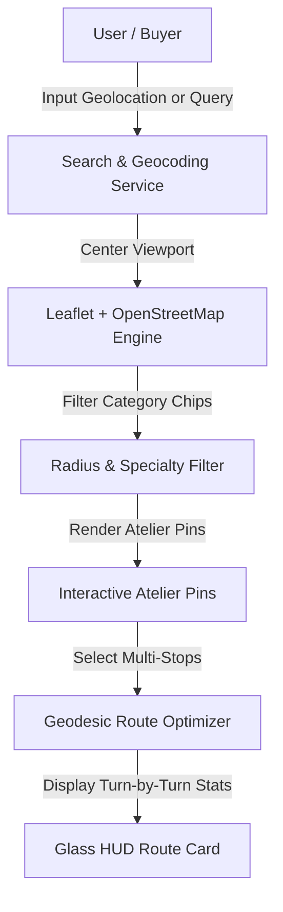

# ✨ Case Study: Jewelry Explorer & Atelier Route Navigator

> **Architectural Case Study**: The Jewelry Explorer is an interactive spatial web GIS application for discovering, filtering, and routing between fine jewelry ateliers, silversmiths, and bullion artisans across luxury districts. It runs on a 100% zero-API-key architecture using OpenStreetMap and Leaflet.

---

## 🛡️ Intellectual Property Notice
*Proprietary routing algorithms, commercial bullion pricing models, and regional artisan supplier datasets are safely maintained in a Private Repository. This public repository contains the complete client frontend application, interactive mapping code, and architectural documentation.*

---

## 🏛️ Spatial Architecture Flow

---

## ⚙️ Core Technical Highlights

### 1. 100% Zero-API-Key Spatial Navigation
- Uses Leaflet.js with open-source OpenStreetMap vector tiles, eliminating Google Maps API billing and quota limits.
- Geodesic distance calculation and multi-stop waypoint sequencing.

### 2. Interactive Glass HUD & Real-Time Filtering
- Real-time search radius slider with instant spatial point-in-polygon filtering.
- Category chips for Fine Jewelry, Silversmiths, Custom Karigars, and Bullion Ateliers.
- Responsive glassmorphic sidebar HUD displaying total route distance, estimated walking duration, and stop counts.

---

## 📸 Visual Showcase

| Interactive Atelier Route Navigator |
| :---: |
|  |

---

## 📁 Repository Contents
- [`frontend/index.html`](./frontend/index.html) — Main single-page spatial map application
- [`frontend/main.js`](./frontend/main.js) — Leaflet mapping, routing algorithms, and UI state handlers
- [`frontend/style.css`](./frontend/style.css) — Glassmorphic HUD styling and layout

---

## 📬 Contact & Author
- **Author**: Tirth ([@tirth2907](https://github.com/tirth2907))
- **Email**: [cryptorth2907@gmail.com](mailto:cryptorth2907@gmail.com)
